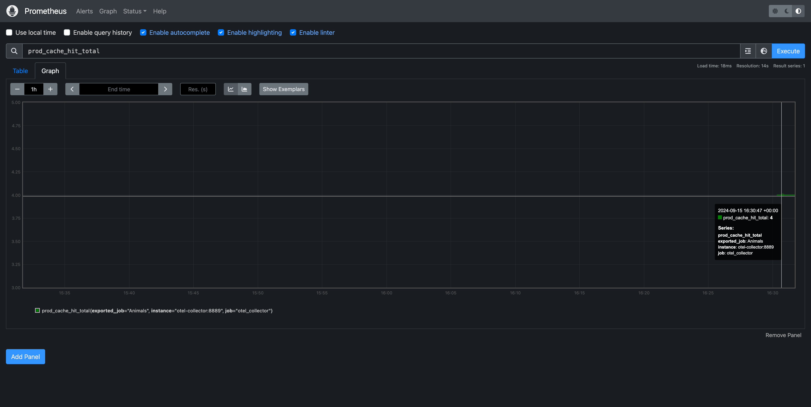
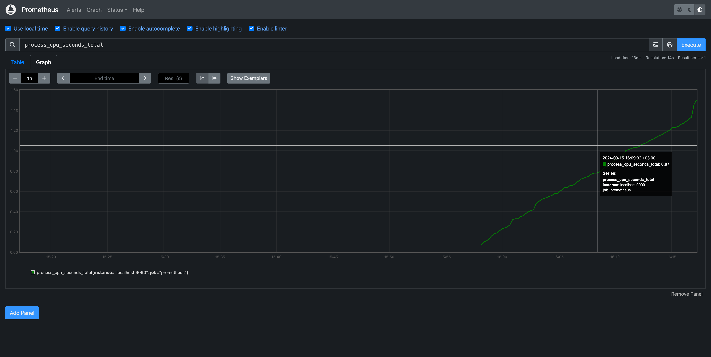

Простой rate-limiter. Сервер ограничивает количество запросов. Мы можем ограничивать как количество клиентов, так и количество запросов от них.
Выбор технологий - на любой вкус. Хоть TCP/HTTP сервер, хоть любые модные/любимые фреймворки. Задача - поиграться

## Трассировка

## Метрики

